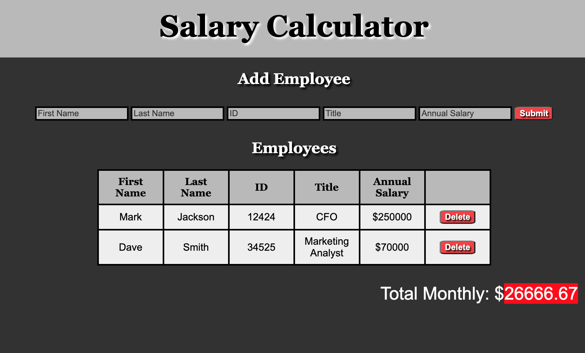

# Project Name

Weekend JQuery Salary Calculator

## Description

- A web application that accepts employee inputs and displays them in a table. The user is able to input the employee's first name, last name, ID number, job title, and annual salary. 
- If any of the fields are left empty the user is alerted to fill out the inputs completely. 
- The application calculates the monthly cost for all the employees based on their combined annual salaries. If the total monthly salaries are above $20,000 the DOM is updated with a red background behind the sum to notify the user they have exceeded the set limit.
- Each row added has a delete button that removes the selected row and updates the running total accordingly to the annual salary of the employee that was removed.
- Added a bonus feature that allows the user to input their own monthly cost limit

Additional README details can be found [here](https://github.com/PrimeAcademy/readme-template/blob/master/README.md).
